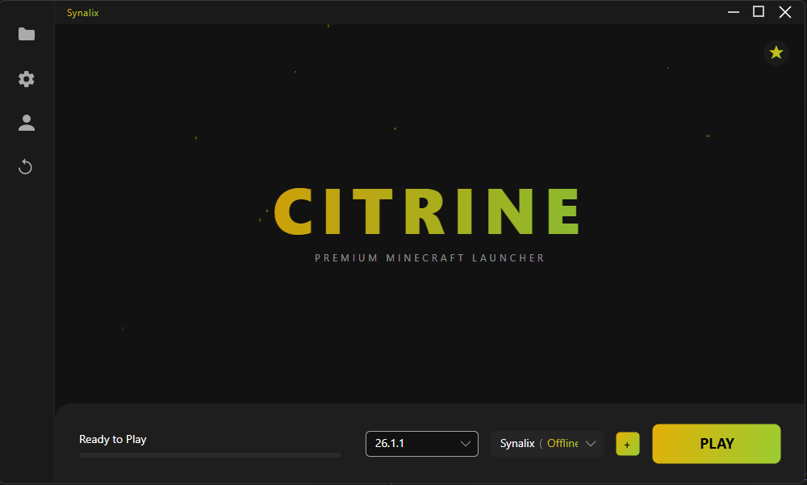
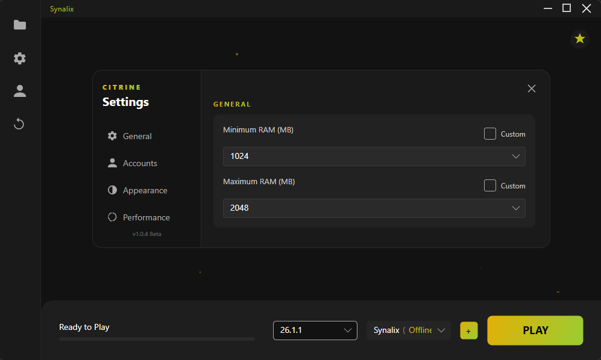

# Citrine Launcher

A simple Minecraft launcher built with Avalonia UI and CmlLib.Core.

It is meant to stay light and easy to use:

- launch Minecraft from a clean custom UI
- add offline or Microsoft accounts
- switch versions and manage multiple instances
- import Modrinth modpacks
- choose a Minecraft folder
- change basic launcher settings
- keep the look simple and readable

## Screenshots




## Requirements

- Windows 10 or Windows 11
- .NET 10 SDK if you want to build it yourself

## Download

Grab the [latest release](https://github.com/Synalix/CitrineLauncher/releases/latest) and run `CitrineLauncher.exe`.

No installer for now.

## Build from source

Run these commands from the repository root.

```bash
dotnet build
```

To publish a self-contained build, run this from the repository root too:

```bash
dotnet publish -c Release -r win-x64 --self-contained true -p:PublishSingleFile=true
```

## Notes

- Settings are saved in `%AppData%\CitrineLauncher`
- Both offline and Microsoft accounts are supported. Microsoft login uses the standard OAuth device-code flow via CmlLib.
- Fabric loader and modpack import (CurseForge/Modrinth) are supported. Vanilla instances use per-instance game directories.

## License

[MIT](https://github.com/Synalix/CitrineLauncher/blob/main/LICENSE)
